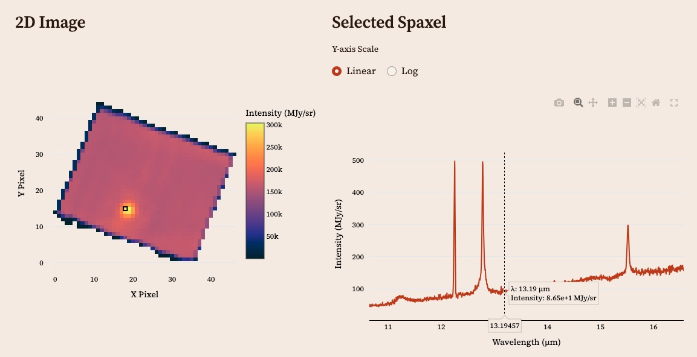

# VULCAN: Visualization Utility for Luminous Cluster Analysis in NIR/MIR
## *A Streamlit web application to explore IFU spectra in the Infrared*

## Project Overview

VULCAN is a web-based interactive visualization tool designed to support astrophysical research on galaxy clusters using spectral cube data from the James Webb Space Telescope's MRS instrument. It focuses on exploring spaxels, gas dynamics, and emission line ratios using Abell 2597 (A2597) as a proxy.

The A2597 dataset was chosen because it is a well studied Brightest Cluster Galaxy (BCG), and currently has public JWST data out on it. This was used to design and write the code for Vulcan in preparation for future JWST datasets. As of now, Vulcan is not ready to handle uploaded datasets.

The general features of the app are listed below:
- Interactive web interface built with Streamlit
- Visualize 2D spatial maps and spectra
- View individual pixel (spaxel) spectra
- Subtract local continuum around emission lines
- Fit Gaussian models to spectral lines
- Generate linewidth maps and estimate gas dynamics
- Impute missing/poor-quality fits with SNR-based Voronoi binning and Spatial KNN

Along with future features: 
- Moment maps of velocity and redshift
- Line ratio analysis
- Support for additional datasets

The plan is to 

## Getting Started

Clone this repository...
requirements for environment should be listed

## App Features

This section details the features Vulcan includes for the user's analysis. Some initial preprocessing steps include converting to rest-frame wavelength. This allows us to identify which emission and absorption lines are which in our spectra. This is not a mandatory step, but most astronomers would use this. Another preprocessing step is background subtraction. Many JWST IFU cubes are already background subtracted, but some are not. The plan is to add code that allows the user to also upload a background FITS file if it wasn't already subtracted. Other preprocessing steps could include dereddening (although this is not as significant for the general exploratory data analysis in this app), and masking out bad pixels based on quality flags from the datacube.

After preprocessing, Vulcan will display 2D spatial maps and spectra, as well as extracting spectra at specific pixels. The user can input pixel coordinates into this function and the corresponding spectrum will pop out to the side.

Another feature is displaying the total continuum of a given emission line, its "locally"-defined continuum, and its subtracted continuum. This allows the user to see the spatial distribution of the gas at those specific wavelengths.

The more complex features of Vulcan include fitting a Gaussian model to each emission line in every pixel. If a pixel doesn't have enough signal-to-noise (matching a threshold set by the user, default is 3), Vulcan will employ Voronoi binning to bin pixels of low signal-to-noise together to create one region. This is useful for pixels near the edge of our FOV, as well as far from the center of the BCG. Once the Gaussian models have been fit, the user may look at any particular model to check by eye how well it fit. Otherwise, a quality level is assigned to each fit based on a set of rules (also defined in the app):

- If any NaN values were returned in the fitting process, this counted as a **failed** fit.
- If any linewidths were negative, this was a **failed** fit.
- If the linewidth error was greater than the actual linewidth, this was a **poor** fit.
- If the amplitude error was more than a third of the actual amplitude, this was a **poor** fit.
- If any linewidths were significantly less than the resolution of the telescope, these were considered **failed** fits.
- If the linewidth and amplitude errors were less than 10% of the actual values, these were considered **excellent** fits.
- Otherwise, the fits were considered **good**

These quality levels were encoded so that a fit quality map could be made to show which pixels had the best fits. In general, we would expect higher singal-to-noise near the center of the BCG, thus more excellent quality fits, which we can see is true for A2597:

From these Gaussian models, Vulcan calculates the linewidth for each emission line, and from these linewidths, one can calculate the velocity and velocity dispersions of the gas in the galaxy. These will be future features of the app.

### Imputation
For the failed and poor quality fits, it is possible to impute values for those pixels. However, there is a danger and near-impossibility with this, as one cannot just create the gas dynamics in a large group of missing pixels. Otherwise, the user is biasing the data to be how they imagine the structure of the gas looks. Our best attempt at recovering some information is to use a spatial k nearest neighbors method, where if a missing pixel has at least k number of neighbors, Vulcan will calculate the average value from those neighbors and impute it into the missing pixel. This gives us some more information near the edges of our high signal-to-noise area, but again, there is nothing we can say at large distances from this area.

Future features of the app might include different imputing methods besides spatial KNN.

## Streamlit features

includes session state, caching, etc.

